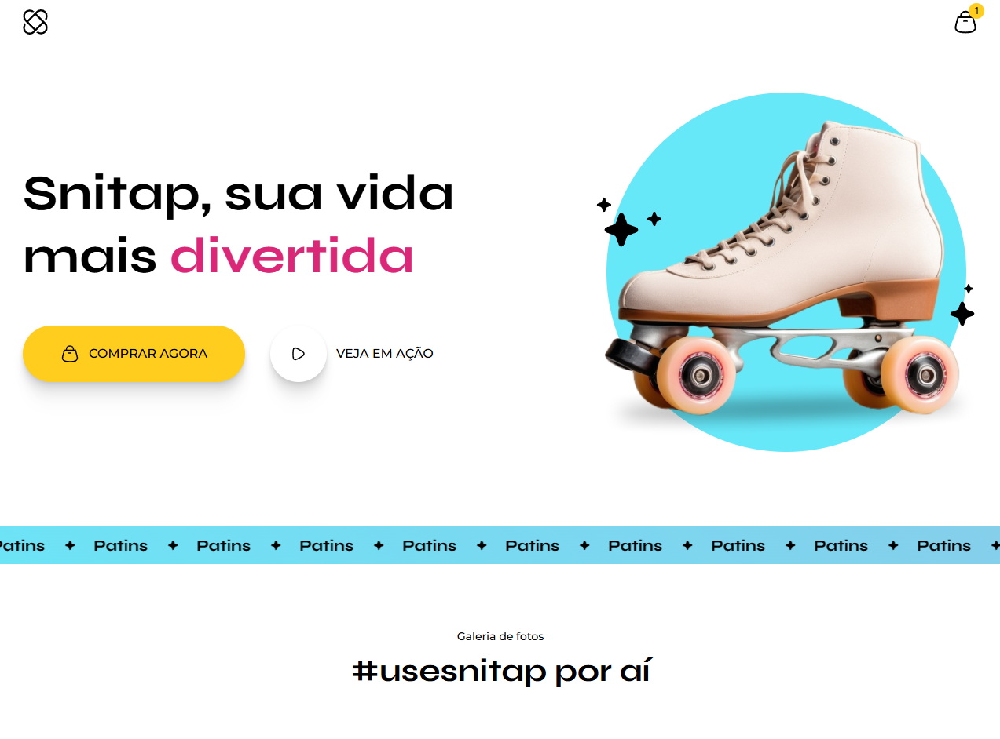

# 🛼 Snitap – Landing Page Animations em CSS

Uma landing page animada em CSS, responsiva e estilosa, criada como projeto para aprendizado e demonstração de animações e efeitos visuais.

## 🔗 Acesse o projeto online
Você pode visualizar o site publicado via GitHub Pages clicando no link abaixo:
👉 [Snitap](https://llorenzojorge.github.io/lp-patins-animation)  

## 🧩 Sumário

- [Sobre o Projeto](#sobre-o-projeto)  
- [Funcionalidades & Destaques](#funcionalidades--destaques)
- [Tecnologias Utilizadas](#tecnologias-utilizadas)

## 📌 Sobre o Projeto

Este é um projeto de landing page com foco em **animações CSS** e experiência visual. A página é voltada para promover uma marca fictícia de patins chamada “Snitap” e demonstra como animações, interações e imagens podem se unir para gerar um efeito dinâmico e envolvente.  

Além disso, a página é **responsiva**, adaptando-se a diferentes tamanhos de tela (desktop e mobile), mantendo estética e usabilidade.

## ✨ Funcionalidades & Destaques

- Animações CSS suaves e atrativas nos elementos visuais (imagens, botões, efeitos de entrada/saída)  
- Layout responsivo, com adaptação para diferentes larguras de tela  
- Galeria de fotos e seções com transições elegantes  
- Interface amigável com botões de ação (“Comprar agora”, “Veja em ação”)  
- Uso de imagens otimizadas para web para melhor desempenho  
- Design limpo e foco em experiência visual  

## 🛠️ Tecnologias Utilizadas

- **HTML5** — marcação semântica  
- **CSS3** — animações, transições, flexbox e media queries  
- **(Opcional)**: pode haver uso de pré-processadores CSS (Sass/SCSS) ou outras ferramentas de build, conforme versão do projeto  

---

Desenvolvido por [Lorenzo Jorge](https://github.com/llorenzojorge) 💻